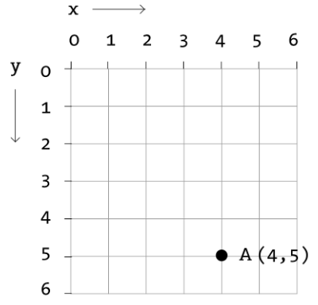
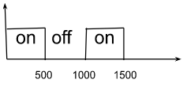
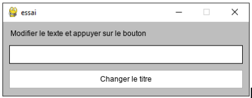
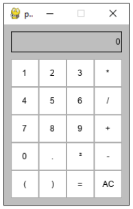
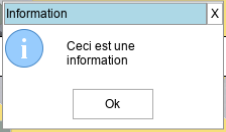
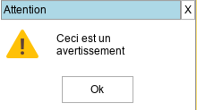
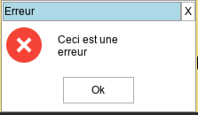
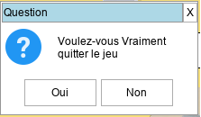
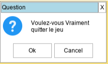
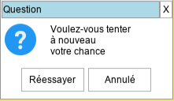

## Structure du programme 


### Installation:

**Dans pycharm :** \
CTRL+ALT+s, puis choisir project -> python interpreter et + puis likeprocessing

**dans le terminal :** \
pip install likeprocessing


### Les fonctions setup(), draw() et run(globals())

Le programme doit contenir deux fonctions, setup() et draw(), et l'exécution est lancée à l'aide de l'instruction run(globals()).

Lorsque l'on exécute l'instruction run(globals()), la fonction setup() est exécutée une fois :


```
from likeprocessing.processing import *
def setup():
    createCanvas(800,600)
    # instructions de paramétrage de l'affichage
```


Cette fonction permet de définir les dimensions de la fenêtre de tracé, et quelques paramètres initiaux. Les valeurs données aux paramètres de la fonction **createCanvas() ** sont affectées automatiquement à deux variables systèmes : **width** pour le premier paramètre et **height** pour le second. Un troisième paramètre **resizable** optionnel permet d'offrir la possibilité de redimensionner la fenêtre avec la souris  On peut récupérer les valeurs de **width** et **height** grâce au fonction **width()** et **height()**

Puis la fonction **draw()** est ensuite exécutée en boucle, après l'exécution de **setup()**:


```
def draw():
    # instructions de dessin
```


Elle contient des instructions qui seront exécutées avec une fréquence réglable, permettant de modifier le contenu de la fenêtre et de créer des contenus statiques ou des animations.

L'instruction **stop()** met fin à l'exécution de la boucle :


```
def compute():
    # instructions de calcul
```


Cette fonction n'est pas obligatoire. Elle permet d'éviter de trop surcharger la fonction **draw()** en réservant celle-ci aux instructions de dessins. La fonction **compute()** si elle existe est insérée dans la boucle et est exécutée avant la fonction **draw()** 


## Structure de base :


```
from likeprocessing.processing import *

def setup():
   createCanvas(400,200)
   background("grey")

def draw():
   pass

run(globals())
```


## Fonctions système


<table>
  <tr>
   <td><strong>Fonctions</strong>
   </td>
   <td><strong>description</strong>
   </td>
  </tr>
  <tr>
   <td>width(), height()
   </td>
   <td>Dimensions de la zone de dessin. Les valeurs de width et height sont définies par les paramètres de la fonction createCanvas().
   </td>
  </tr>
  <tr>
   <td>createCanvas()
   </td>
   <td> La fonction createCanvas(largeur,hauteur) permet de dimensionner la fenêtre de l'application. En plus de la largeur et de la hauteur on peut ajouter un troisieme paramètre à True pour que la fenêtre puisse être redimensionnée. (ex createCanvas(400,300,True).
     <BR>On peut aussi changer l'icone de la fenêtre avec le paramètre facultatif icone :<br>
     createCanvas(400,300,True,icone="image.png")  
   </td>
  </tr>
  <tr>
   <td>title("mon titre")
   </td>
   <td> La fonction title("mon titre") permet de changer le titre de la fenêtre par mon titre
   </td>
  </tr>
  <tr>
   <td>set_icone("icone.jpg")
   </td>
   <td> La fonction set_icone() permet de changer l'icône de la fenêtre
   </td>
  </tr>
</table>


## Rafraîchissement


<table>
  <tr>
   <td><strong>Fonctions</strong>
   </td>
   <td><strong>description</strong>
   </td>
  </tr>
  <tr>
   <td>frameCount()
   </td>
   <td>Nombre d'images affichées depuis le démarrage du programme.
   </td>
  </tr>
  <tr>
   <td>frameRate() \
getFrameRate()
   </td>
   <td>Renvoie le nombre d'images affichées chaque seconde.
   </td>
  </tr>
  <tr>
   <td>frameRate(valeur) \
setFrameRate(valeur)
   </td>
   <td>Spécifie le nombre d'images à afficher chaque seconde.
   </td>
  </tr>
  <tr>
   <td>noLoop()
   </td>
   <td>Si cette instruction est présente dans la fonction setup la fonction draw sera exécutée une seule fois. Si cette instruction est présente dans la fonction draw, les instructions de la fonction draw en cours sont exécutées (il n'y a pas d'interruption) mais celle-ci ne sera pas appelée à nouveau.
   </td>
  </tr>
  <tr>
   <td>loop()
   </td>
   <td>Relance l'exécution en boucle de draw().
   </td>
  </tr>
</table>


## Couleurs


## Désigner une couleur


<table>
  <tr>
   <td><strong>syntaxe</strong>
   </td>
   <td><strong>description</strong>
   </td>
  </tr>
  <tr>
   <td>'red'
   </td>
   <td>nom de couleur
   </td>
  </tr>
  <tr>
   <td>120
   </td>
   <td>niveau de gris : 0 - 255
   </td>
  </tr>
  <tr>
   <td>(100, 125, 255)
   </td>
   <td>couleur r, v, b (décimal) : 0 - 255
   </td>
  </tr>
  <tr>
   <td>'#2aff95'
   </td>
   <td>couleur r, v, b (hexadécimal) : 00 - ff
   </td>
  </tr>
</table>


## Dessiner en couleur


<table>
  <tr>
   <td><strong>Fonctions</strong>
   </td>
   <td><strong>description</strong>
   </td>
  </tr>
  <tr>
   <td>background(couleur)
   </td>
   <td>Définit la couleur d'arrière-plan de la zone de dessin (255 par défaut).
   </td>
  </tr>
  <tr>
   <td>set_background_image(image: Image)
   </td>
   <td>Définit l'image d'arrière-plan de la zone de dessin.
   </td>
  </tr>
  <tr>
   <td>get_background_image()
   </td>
   <td>Récupère l'image d'arrière-plan de la zone de dessin.
   </td>
  </tr>
  <tr>
   <td>save_background():
   </td>
   <td>fait une copie du contenu de la fenêtre et le sauvegarde dans l'image d'arrière plan.
   </td>
  </tr>
  <tr>
   <td>fill(couleur=None)
   </td>
   <td>Définit la couleur de remplissage des formes (255 par défaut) et réactive le remplissage des formes. Sans paramètre seul le remplissage est activé (utile après un noFill()). Retourne la valeur précédente du remplissage.
   </td>
  </tr>
  <tr>
   <td>fill_mouse_on(couleur: any):
   </td>
   <td>initialise la couleur de fond des figures qui affichera quand la souris est dessus.
   </td>
  </tr>
  <tr>
   <td>get_fill()
   </td>
   <td>Retourne la couleur de fond actuelle
   </td>
  </tr>
  <tr>
   <td>noFill()
   </td>
   <td>Désactive la couleur de remplissage.
   </td>
  </tr>
  <tr>
   <td>stroke(couleur)
   </td>
   <td>Définit la couleur du tracé des bords des formes et des lignes("black" par défaut). Retourne la valeur précédente de la couleur.
   </td>
  </tr>
  <tr>
   <td>get_stroke()
   </td>
   <td>retourne la couleur des bords actuelle
   </td>
  </tr>
  <tr>
   <td>noStroke()
   </td>
   <td>Désactive le tracé du contour des figures. Retourne la valeur précédente de la couleur.
   </td>
  </tr>
  <tr>
   <td>save_fill_stroke()
   </td>
   <td>Sauvegarde les paramètres fill et stroke
   </td>
  </tr>
  <tr>
   <td>restore_fill_stroke()
   </td>
   <td>recharge les paramètres fill et stroke précédemment sauvegardé avec <strong>save_fill_stroke</strong>
   </td>
  </tr>
</table>


Si **noFill()** et **noStroke() **sont exécutées en même temps, rien n'est tracé dans la zone de dessin.


## Formes


### Primitives 2d

L'origine du repère est située en haut à gauche. Les abscisses augmentent de gauche à droite, les ordonnées augmentent de haut en bas.





<table>
  <tr>
   <td><strong>fonctions</strong>
   </td>
   <td><strong>description</strong>
   </td>
  </tr>
  <tr>
   <td>point(x, y)
   </td>
   <td>Trace un point de coordonnées (x, y). carré de 2x2 pixels
   </td>
  </tr>
  <tr>
   <td>line(x1, y1, x2, y2)
   </td>
   <td>Trace un segment reliant les deux points de coordonnées (x1, y1) et (x2, y2).
   </td>
  </tr>
  <tr>
   <td>ellipse(x, y, largeur, hauteur)
   </td>
   <td>Tracer une ellipse dont le centre a pour coordonnées (x, y) et dont la largeur et la hauteur prennent les valeurs fixées.
   </td>
  </tr>
  <tr>
   <td>circle(x, y, diametre)
   </td>
   <td>Trace un cercle dont le centre a pour coordonnées (x, y) et dont le diamètre prend la valeur fixée. Idem ellipse((x, y, diametre, diametre)
   </td>
  </tr>
  <tr>
   <td>arc(x,y,largeur,hauteur,,angleDebut, angleFin)
   </td>
   <td>Créer une portion d'ellipse type part de tarte qui pourra être rempli entre les points repérés par les angles angleDébut et angleFin (unité courante). x et y sont les coordonnées du centre du cercle.  
   </td>
  </tr>
  <tr>
   <td>circle_arc(x,y,rayon,angleDebut, angleFin)
   </td>
   <td>idem arc mais à partir d'un disque
   </td>
  </tr>
  <tr>
   <td>ellipseMode(corners_center: str)
   </td>
   <td>Définie la position des points x et y des fonctions basées sur ellipse. par défaut : "corners" x et y sont les coordonnées du point en haut à gauche du rectangle dans lequel est inscrit l'ellipse. si les paramètre est "center" x et y représente le centre du rectangle. Retourne la valeur précédente du mode.
   </td>
  </tr>
  <tr>
   <td>rect(x, y, largeur, hauteur)
   </td>
   <td>Créer un rectangle aux coordonnées x,y de largeur largeur et de hauteur. Si rectMode('center') x et y sont les coordonnées du centre du rectangle. Si rectMode('corners') x,y sont les coordonnées du coin haut gauche. Le rectangle est rempli par la couleur définie par fill(couleur). Si le paramètre image est renseigné (image= ...) le fond du rectangle sera occupé pas l'image retaillée aux dimensions du rectangle sauf si largeur et/ou hauteur sont nulles (ou non renseignées). largeur et/ou hauteur seront alors celles de l'image. Les paramètres <strong>allign_h </strong>(left, center et right) et  <strong>allign_v</strong> (top,center et bottom) permettent d'aligner l'image dans un cadre plus grand qu'elle.
   </td>
  </tr>
  <tr>
   <td>square(x, y, cote)
   </td>
   <td>Trace un carré dont le sommet en haut à gauche a pour coordonnées (x, y) et dont le côté prend la valeur fixée. fonctionnement idem rectangle
   </td>
  </tr>
  <tr>
   <td>rectMode(corners_center: str)
   </td>
   <td>Définie la position des points x et y des fonctions basées sur rect. par défaut : "corners" x et y sont les coordonnées du point en haut à gauche du rectangle. si les paramètre est "center" x et y représente le centre du rectangle. Retourne la valeur précédente du mode.
   </td>
  </tr>
  <tr>
   <td>triangle(x1, y1, x2, y2, x3, y3)
   </td>
   <td>Trace un triangle dont les trois sommets ont pour coordonnées (x1, y1), (x2, y2), et (x3, y3).
   </td>
  </tr>
  <tr>
   <td>quad(x1, y1, x2, y2, x3, y3, x4, y4)
   </td>
   <td>Trace un quadrilatère dont les quatre sommets ont pour coordonnées (x1, y1), (x2, y2), (x3, y3) et (x4, y4).
   </td>
  </tr>
  <tr>
   <td>k_line(points)
   </td>
   <td>trace un ligne brisée à partir d'une liste de points [[1,2],[5,6],[8,3],.....]. (nb_point = nb_segments + 1)
   </td>
  </tr>
</table>


### Tracés


<table>
  <tr>
   <td><strong>fonctions</strong>
   </td>
   <td><strong>description</strong>
   </td>
  </tr>
  <tr>
   <td>strokeWeight(epaisseur)
   </td>
   <td>Définit l'épaisseur du tracé en pixels (par défaut : 1 pixel). Retourne la valeur précédente de la largeur du trait
   </td>
  </tr>
  <tr>
   <td>noStroke()
   </td>
   <td>Désactive le tracé du contour des figures en mettant la largeur du bord à 0. Retourne la valeur précédente de la largeur.
   </td>
  </tr>
  <tr>
   <td>stroke(couleur)
   </td>
   <td>Définit la couleur du tracé des bords des formes et des lignes ("black" par défaut). Si aucune valeur n'est passée, celle-ci retourne la couleur actuelle. Retourne la valeur précédente de la couleur.
   </td>
  </tr>
</table>


## Paramètres optionnels:

Les paramètres optionnels sont passés directement dans la fonction et ne concernent que celle-ci: 

fill, no_fill, fill_mouse_on, stroke, stroke_weight, command, fill_mousse_on, name. Pour les rectangles nous avons en plus image et border_rounded 

exemple :


```
triangle(20, 10, 50, 15, 40, 70, fill = "green", fill_mouse_on="yellow", stroke_weight=3)
rect(10,100,100,50,fill = "red", image=loadImage("image.jpg")) # rectangle avec une image
rect(150,100,100,60,fill= "blue",border_rounded = 10) # rectangle au coins arrondis avec un rayon de 10px 
```


l'ajout de **command = ma_fonction** ou **command_mouse_over = ma_fonction** au paramètre **fill_mouse_on="couleur"** permet d'exécuter la fonction **ma_fonction()**. Si l'on veut attribuer **ma_fonction** à plusieurs formes il est possible d'ajouter le paramètre **name = valeur**. Dans ce cas, la fonction **ma_fonction(name)** sera exécutée . Il faudra créer impérativement soit : 

def ma_fonction():

    pass

ou

def ma_fonction(nom):

    pass

Remarque:<br>
avec le paramètre command exécute la fonction si la forme est cliquée alors qu'avec command_mous_over elle sera exécutée simplement si la souris est sur la forme.<br>
Si les deux paramètres sont présents les deux fonctions sont exécutées.

## Textes


<table>
  <tr>
   <td><strong>fonctions</strong>
   </td>
   <td><strong>description</strong>
   </td>
  </tr>
  <tr>
   <td>text(chaine, x, y)
   </td>
   <td>Affiche la chaîne à la position (x, y) dans une boite ajustée. couleur, largeur bord et couleur bord de la boite idem formes. Accepte les paramètres optionnels
   </td>
  </tr>
  <tr>
   <td>text(chaine, x, y, largeur, hauteur)
   </td>
   <td>Affiche la chaîne à la position (x, y) dans une boite de dimensions largeur x hauteur. couleur, largeur bord et couleur bord de la boite idem formes. largeur et hauteur sont optionnels
   </td>
  </tr>
  <tr>
   <td>textAlign(alignement_horizontal)
<p>
textAlign(alignement_horizontal, alignement_vertical)
   </td>
   <td>Spécifie l'alignement horizontal parmi LEFT, CENTER, et RIGHT et l'alignement vertical parmi TOP, BOTTOM, CENTER, et BASELINE
   </td>
  </tr>
  <tr>
   <td>textFont(police)
<p>
textFont(police, taille)
   </td>
   <td>Spécifie la police de caractères et éventuellement sa taille. Retourne la police et la taille précédente 
   </td>
  </tr>
  <tr>
   <td>textSize(taille)
   </td>
   <td>Spécifie la taille de la police de caractères. Retourne la taille précédente de la police
   </td>
  </tr>
  <tr>
   <td>textStyle(style)
   </td>
   <td>Spécifie le style parmi NORMAL, ITALIC, BOLD et BOLDITALIC
   </td>
  </tr>
  <tr>
   <td>textWidth(chaine)
   </td>
   <td>Largeur en pixels de l'affichage de chaîne, dans la police et taille actuelles
   </td>
  </tr>
</table>


## Paramètres optionnels spécifique à text:

Les paramètres optionnels sont passés directement dans la fonction et ne concernent que celle-ci: 

la fonction text possèdes elle aussi des paramètres optionnels qui ne concernent que la fonction en cours : \
**font, font_size, font_color** qui permettent  de définir la police, la taille des caractères ainsi que la couleur de ceux-ci. 

**allign_h et allign_v** permettent de positionner le texte dans la boîte de texte comme **textAllign()**.

**padx et pady** permettent de créer une marge autour du texte (valeur en pixels)  \
exemple : 


```
text("salut les amis",20,30,300,allign_h="center",font="arial",font_size=48,fontTools="green",pady=10)
```


Ce code va afficher "salut les amis" dans un cadre de longueur 300 à la position x=20 et y=30. La hauteur du cadre est calculée en fonction de la hauteur du texte (font_size). **pady=10** ajoute 10 pixels au dessus et en dessous du texte. **Si la hauteur du cadre est donnée, si celle-ci est trop petite le texte sortira du cadre.**


## Événements


### Touches du clavier


<table>
  <tr>
   <td><strong>fonctions</strong>
   </td>
   <td><strong>description</strong>
   </td>
  </tr>
  <tr>
   <td>key()
   </td>
   <td>état des touches du clavier (list)
   </td>
  </tr>
  <tr>
   <td>keyCode()
   </td>
   <td>Code de la dernière touche appuyée.
   </td>
  </tr>
  <tr>
   <td>keyIsPressed()
<p>
isKeyPressed()
   </td>
   <td>Vaut True lorsqu'une touche du clavier est appuyée et False sinon.
   </td>
  </tr>
  <tr>
   <td>keyIsDown(code)
<p>
keyIsDown(touche)
   </td>
   <td>Vaut True si la touche concernée est appuyée et False sinon.
   </td>
  </tr>
</table>


### Souris


<table>
  <tr>
   <td><strong>fonctions</strong>
   </td>
   <td><strong>description</strong>
   </td>
  </tr>
  <tr>
   <td>mouseX(), mouseY()
   </td>
   <td>Coordonnées du pointeur de la souris
   </td>
  </tr>
  <tr>
   <td>mouseXY()
   </td>
   <td>Coordonnées du pointeur de la souris sous forme de tuple
   </td>
  </tr>
  <tr>
   <td>mouseIsPressed()
   </td>
   <td>Vaut True si la souris est cliquée, et False sinon.
   </td>
  </tr>
  <tr>
   <td>fill_mouse_on(couleur:str)
   </td>
   <td>Change la couleur des formes quand on passe la souris dessus. Non actif par défaut.
   </td>
  </tr>
  <tr>
   <td>noFill_mouse_on()
   </td>
   <td>annule l'effet de fill_mouse_on()
   </td>
  </tr>
  <tr>
   <td>mouse_click_down()
   </td>
   <td>renvoie True lors du passage de relâché à appuyé du bouton de la souris.
   </td>
  </tr>
  <tr>
   <td>mouse_click_up()
   </td>
   <td>renvoie True lors du passage de appuyé à relâché du bouton de la souris.
   </td>
  </tr>
  <tr>
   <td>mouse_click()
   </td>
   <td>idem mouseIsPressed()
   </td>
  </tr>
  <tr>
   <td>mouse_wheel_state()
   </td>
   <td>retourne 1 si la roulette de la souris est tournée vers l'avant, -1 vers l'arrière et 0 si elle est immobile.
   </td>
  </tr>
</table>


## Mathématiques


### Angles


<table>
  <tr>
   <td><strong>fonctions</strong>
   </td>
   <td><strong>description</strong>
   </td>
  </tr>
  <tr>
   <td>angleMode(mode_angle:str)
   </td>
   <td>Définit l'unité de mesure des angles. \
 'rad' les angles des fonctions trigonométriques seront pris comme des radians (défaut) \
 'deg' les angles des fonctions trigonométriques seront pris comme des degrés \
'grd' les angles des fonctions trigonométriques seront pris comme des grades \
Une exception est levée en cas d'erreur de paramètre
<p>
si mode_angle == "" la valeur de mode est retournée (str)
   </td>
  </tr>
  <tr>
   <td>cos(), sin(), tan(), acos(),asin(),atan(),atan2()
   </td>
   <td>Fonctions trigonométriques usuelles l'unité considérée sera celle choisie avec angleMode(). atan2 : même fonctionnement que la fonction math.atan2 mais l'unité de l'angle retourné dépend  de angleMode()  
   </td>
  </tr>
  <tr>
   <td>degrees(mesure) \
radians(mesure) \
grades(mesure)
   </td>
   <td>Convertit une mesure d'angle en degrés, en radians ou en grades. l'unité de mesure dépend de angleMode(). 
   </td>
  </tr>
  <tr>
   <td>HALF_PI, PI, QUARTER_PI, TWO_PI
   </td>
   <td>Constantes permettant respectivement d'approcher les valeurs de π/2, π, π/4, 2π
   </td>
  </tr>
</table>


### Géométrie


<table>
  <tr>
   <td><strong>fonctions</strong>
   </td>
   <td><strong>description</strong>
   </td>
  </tr>
  <tr>
   <td>dist(x1,y1,x2,y2)
   </td>
   <td>retourne la distance entre deux points
   </td>
  </tr>
  <tr>
   <td>midPoint(x1, y1, x2, y2)
   </td>
   <td>retourne le milieu d'un segment défini par deux points
   </td>
  </tr>
</table>


## Images


<table>
  <tr>
   <td><strong>fonctions</strong>
   </td>
   <td><strong>description</strong>
   </td>
  </tr>
  <tr>
   <td>loadImage(chemin)
   </td>
   <td>Charge une image à partir d'un chemin et crée un objet Image. Si nécessaire, l'image peut être préchargée en plaçant l'appel à la fonction loadImage en debut de programme.
   </td>
  </tr>
  <tr>
   <td>loadImages((liste_images:list[str],sens=0) ->Image:
   </td>
   <td>Retourne une surface qui est l'assemblage de toutes les images
    de la liste. Si sens = 1 les images sont assemblées verticalement
    et horizontalement si sens =0. Ex: loadImages(["image1.png","image2.jpg"])
   </td>
  </tr>
  <tr>
   <td>background(Image)
   </td>
   <td>Affiche une Image en fond d'écran
   </td>
  </tr>
  <tr>
   <td>image(image, x, y)
   </td>
   <td>Affiche une Image en plaçant le pixel en haut à gauche au point de coordonnées (x, y) dans la zone de dessin.
   </td>
  </tr>
  <tr>
   <td>copy_image(picture: Image, rect=None) -> Image
   </td>
   <td>retourne une copie de picture ou une partie de picture au dimensions de rect
   </td>
  </tr>
  <tr>
   <td>get_pixel_color(picture: Image, pos: tuple) -> tuple
   </td>
   <td>retourne la valeur de la couleur d'un pixel d'une image (picture)
<p>
sous la forme d'un tuple
   </td>
  </tr>
  <tr>
   <td>resize_image(picture:Image,size : tuple
   </td>
   <td>retourne une image redimensionné en fonction de size : (largeur,hauteur) 
   </td>
  </tr>
</table>


## Transformations


<table>
  <tr>
   <td><strong>fonctions</strong>
   </td>
   <td><strong>description</strong>
   </td>
  </tr>
  <tr>
   <td>translate(x,y)
   </td>
   <td>applique une translation à toutes les fonctions de dessin et d'image. x et y sont des valeurs relatives qui s'ajoutent aux translations précédentes.
<p>
La translation est remise à zéro avant chaque exécution de la fonction draw().
   </td>
  </tr>
  <tr>
   <td>get_translate()
   </td>
   <td>retourne la valeur de la translation sous la forme d'un tuple (x,y)
   </td>
  </tr>
  <tr>
   <td>init_translate()
   </td>
   <td>Force la remise à zéro de la translation. (A utiliser dans la fonction draw() en cas de besoin 
   </td>
  </tr>
  <tr>
   <td>rotate(angle,axis)
   </td>
   <td>applique une rotation &lt;angle> par rapport à &lt;axis>. à toutes les fonctions de dessin et d'image. angle est une valeur absolue. Par défaut axis vaut (0,0). Cette fonction retourne la valeur précédente prise par la fonction sous la forme d'un tuple.
   </td>
  </tr>
  <tr>
   <td>flip_h(axe_h)
   </td>
   <td>entraîne une symétrie horizontale par rapport à la droite y = axe_h
   </td>
  </tr>
  <tr>
   <td>flip_v(axe_v)
   </td>
   <td>entraîne une symétrie verticale par rapport à la droite x = axe_v
   </td>
  </tr>
</table>


## Temporisations


<table>
  <tr>
   <td><strong>fonctions</strong>
   </td>
   <td><strong>description</strong>
   </td>
  </tr>
  <tr>
   <td>t=Tempo(duree_ms)
   </td>
   <td>t=Tempo(1000) créer un objet de temporisation t de durée 1000 ms qui se relance indéfiniment. 
    
   </td>
  </tr>
  <tr>
   <td>t.fin()
   </td>
   <td>renvoie True lorsque la temporisation est terminée. Pour notre exemple au bout de 500 ms.
   </td>
  </tr>
  <tr>
   <td>t.is_on()
   </td>
   <td>renvoie True si la temporisation est à on.
   </td>
  </tr>
  <tr>
   <td>t.is_off()
   </td>
   <td>renvoie True si la temporisation est à off.
   </td>
  </tr>
  <tr>
   <td>t.set_tempo(duree_ms)
   </td>
   <td>permet de réinitialiser la temporisation avec une nouvelle valeur.
   </td>
  </tr>
  <tr>
   <td>t.reset()
   </td>
   <td>force le redémarrage de la temporisation.
   </td>
  </tr>
   <td>t=Monostable(duree_ms)
   </td>
   <td>t=Monostable(500) créer un objet de temporisation t de durée 500 ms qui ne se relance qu'après execution de la methode reset() 
   </td>
<tr>
   <td>t=Pwm(500,25) 
    </td>
    <td>
    créer un objet générateur de signaux carré de période 500 ms et de rapport cyclique 25% 
   </td>
  </tr>
</table>

Comme les objets Monostable et Pwm héritent de Tempo ils en possèdent les méthodes.

# Tutoriel Interface homme Machine


l’IHM d’un programme permet à l’utilisateur d’interagir avec celui-ci.

En mode console les instructions print et input permettent de réaliser une interaction sommaire entre le programme et l’utilisateur.

En mode graphique l’interaction sera plus poussée.


## IHM en python avec LikeProcessing


### à faire vous même 1

Taper le code suivant dans un nouveau fichier dans votre ide préféré :


```
from likeprocessing.processing import *

ihm = IhmScreen()

def setup():
   createCanvas(400, 200)
   ihm.init()
   background("grey")
def compute():
ihm.scan_events()


def draw():
ihm.draw()


run(globals())
```


Quand vous exécutez ce code une fenêtre fonctionnelle vide apparaît.


## Ajouter des Widgets à l’intérieur de la fenêtre.

Nous allons ajouter du texte dans la fenêtre.


### à faire vous même 2

Ajouter le code suivant :


```
etiquette1 = Label(ihm, (10, 10, 0, 0), "notre premier texte")
```


 et lancer le programme. Que se passe-t-il ?

Maintenant ajouter


```
ihm.addObjet(etiquette1)
```


 et lancer le programme. Que se passe-t-il ?

Ajouter : 


```
ihm.pack(["obj_1"])

```


Que se passe-t-il ?

Essayer pack(margin_left=10) , pack(margin_right=10)

Ajouter une étiquette2 à la fenêtre.


```
etiquette2 = Label(ihm, (10, 10, 0, 0), "etiquette2")
ihm.addObjet(etiquette2)
```


Où se place-t-elle sans utiliser **pack** ?

Essayer avec la méthode pack et conclure.

Remarque :

on peut utiliser la méthode addObjet en lui passant une liste d'objet  


```
ihm.addObjet([texte,entry, bouton])
```


## Interaction des éléments (widget) avec l’utilisateur.

On souhaite réaliser interface suivante qui contient :




une étiquette (Label) donnant une explication à l’utilisateur, une zone de texte modifiable (LineEdit) et un bouton (Bouton) qui permettra de changer le titre de la fenêtre par le texte entré par l’utilisateur.


```
etiquette = Label(ihm, (10, 10, 0, 0), "Modifier le texte et appuyer sur le bouton")
texte = LineEdit(ihm,(10,30,100,30),"")
bouton = Bouton(ihm, (10, 60, 100, 30), "Changer le titre")
ihm.addObjet([etiquette,texte, bouton])
ihm.pack(["obj_1","obj_2","obj_3"])
```


n’oubliez pas d’utiliser les méthode addObjet() et pack()

Lorsque vous lancez le programme, que se passe-t-il ?

Modifier votre programme en complétant la création du bouton avec :


```
command=lambda : title(texte.text())
```


texte.text() permet de récupérer le texte écrit par l’utilisateur.

lambda permet de définir une fonction sur une ligne (le paramètre **command** à besoin d’une fonction comme valeur). On peut aussi donner le nom d'une fonction que l'on aura déjà créé.

Tester votre programme et modifier les paramètres de pack() en utilisant expand="x",pady=10,padx=10 pour obtenir la fenêtre ci-dessus (vous pouvez changer la hauteur de la fenêtre).


## Précision sur l'objet IhmScreen

L'objet IhmScreen possède plusieurs méthodes pour gérer l'interface graphique:

addObjet permet d'ajouter des widgets à l'interface. Si les objets n'ont pas de nom (paramètre nom non renseigné) la méthode les nomme "obj_1", "obj_2",... 

objet_by_name(nom_objet) permet de récupérer l'objet de l'interface pour par exemple changer sa couleur, récupérer la valeur du texte d'un LineEdit ou changer le **text()** d'un Label...

Ex : 


```
ihm.addObjet(LineEdit(ihm,(10,30,100,30),""),"texte")
```


Cette commande ajoute à l'interface un champ modifiable qui sera appelé "texte" 

print(ihm.objet_by_name("texte").text()) affichera sur le console la valeur du champ.

On peut si on le souhaite supprimer un objet : ihm.delObjet(nom_objet) ou simplement le rendre invisible avec ihm.objet_by_name(nom_objet).visible = False


## Création d’une calculatrice

On désire réaliser l’interface suivante :

Il faut créer des boutons pour chaque touche ainsi qu’une étiquette pour simuler l’écran de la calculatrice.


```
touche = [["1","2","3","*"],
         ["4","5","6","/"],
         ["7","8","9","+"],
         ["0",".","²","-"],
         ["(",")","=","AC"]]

for i in range(5):
   for j in range(4):
       ihm.addObjet(Bouton(None, (10+.....*40, 50+.....*40, 40, 40), touche[i][j], command=lambda v=touche[i][j]: calcule(v)))
```


la dernière ligne peut être remplacer par :


```
ihm.addObjet(Bouton(None, (10+.....*40, 50+.....*40, 40, 40), touche[i][j], command=calcule, name = touche[i][j])) 
```


ce qui évite d'utiliser la fonction lambda.

Le paramètre **name** sera envoyé à la fonction **calcule**.


### à faire vous même 3

créer l’IHM de la calculatrice.





### à faire vous même 4

Réalisation de l’interface graphique d'un logiciel de dessin

On veut créer l’IHM du logiciel de dessin my_paint dont le code est le suivant:


```
from likeprocessing.processing import *

forme = "cercle"
couleur = "blue"
point1 = None
figure = []


def draw_figure():
   for f in figure:
       largeur = abs(f[1][0] - f[2][0])
       hauteur = abs(f[1][1] - f[2][1])
       if f[0] == "rectangle":
           rect(*f[1],largeur,hauteur,fill=f[3])
       elif f[0] == "ligne":
           line(*f[1],*f[2],stroke=f[3])
       elif f[0] == "cercle":
           circle(*f[1],dist(*f[1],*f[2]),fill=f[3],center_mode="center")


def setup():
   createCanvas(400, 200,True)
   background("grey")
   title("my_paint")


def compute():
   global point1
   if mouse_click_down():
       if point1 is None:
           point1 = mouseXY()
           figure.append([forme, point1, point1, couleur])
   if len(figure)>0 and mouseIsPressed():
       figure[-1][2] = mouseXY()
   if mouse_click_up():
       figure[-1][2] = mouseXY()
       point1 = None


def draw():
   draw_figure()


run(globals())
```


forme peut prendre les valeurs suivantes : "rectangle","cercle","ligne" et couleur les couleurs acceptés par likeprocessing.

l'interface doit permettre :

- afficher le type de forme en cours

- de changer le type de forme,

- couleur des figures,

- la couleur du fond,

- effacer la dernière forme,

- effacer le dessin,


## Utilisation des boîtes de dialogues d'information (Show)  et des boîtes de dialogues de questionnement (Ask…)

Ces boîtes ont un comportement bloquant c'est à dire que seule l'interaction avec avec la boite est prise en compte : les fonctions compute(), draw(), exit() ne sont plus appelées.


```
ShowInfo(ihm, "Ceci est une \ninformation").response()
```





```
ShowWarning(ihm, "Ceci est un \navertissement").response()
```





```
ShowError(ihm, "Ceci est une \nerreur").response()
```





```
AskYesNo(ihm, "Voulez-vous Vraiment\nquitter le jeu").response()
```





```
AskOkCancel(ihm, "Voulez-vous Vraiment\nquitter le jeu").response()
```





```
AskRetriyCancel(ihm, "Voulez-vous tenter\nà nouveau\nvotre chance").response()
```





### Utilisation: 

les bouton sont numéroté de la gauche vers la droite (0,1) .Le clique sur croix de la boîte retourne la valeur 4 


```
if AskYesNo(ihm, "Voulez-vous tenter\nà nouveau\nvotre chance").response() == 0:
```


Avec le code ci-dessus, la condition sera vraie si le bouton de gauche est cliqué. 

Exemple d'utilisation d'une boîte et de la fonction exit().

La fonction exit() est une fonction facultative (comme compute) destinée à simplifier la sortie du programme que ce soit par l'intermédiaire d'un bouton dédié ou par l'utilisation de la croix de fermeture de la fenêtre.

Sans cette fonction lorsque que l'on appuie sur la croix la fonction **set_quit(True)** est exécutée ce qui à pour effet de fermer immédiatement l'application.

 le code suivant qui utilise la fonction exit() permet de faire les choses avec plus d'élégance : 


```
def exit():
   set_quit(False)
   if AskYesNo(ihm, "Voulez-vous Vraiment\nquitter le jeu").response() == 0:
       set_quit(True)
```


ajout d'un bouton dédié à la fermeture du programme : 


```
ihm.addObjet(Bouton(ihm, (0, 0, 100, 0), "Quitter",
                   font_size=20, command=lambda : set_quit(True) ), bp_quitter")
```


On peut aussi passer par une fonction intermédiaire:


```
def bp_quitter():
   set_quit(True)

ihm.addObjet(Bouton(ihm, (0, 0, 100, 0), "Quitter",
                   font_size=20, command=bp_quitter), "bp_quitter")
```


 

**Remarque**: on peut rendre si nécessaire la croix de la fenêtre likeprocessing inactive avec la fonction  **disabled_quit_cross(). **La fonction** enabled_quit_cross()** permet de la réactivée.

 
